#  Where Are the Robots

*“Can you find the robots? https://jupiter.challenges.picoctf.org/problem/56830/ (link) or http://jupiter.challenges.picoctf.org:56830”*

<br>

When we access the site, it's a simple page with nothing but a title and a phrase.


<br>

So, just like the title of the challenge says, let’s access the robots directory.


<br>

There’s no hint for what to do after this, but we can check the `/1bb4c.html` file.


<br>

There it is—the flag.

<br>

# Insp3ct0r

*“Kishor Balan tipped us off that the following code may need inspection: https://jupiter.challenges.picoctf.org/problem/9670/ (link) or http://jupiter.challenges.picoctf.org:9670”*

<br>

When we access the link provided by the challenge, it shows a simple page with two interactive buttons, but there’s nothing else there.

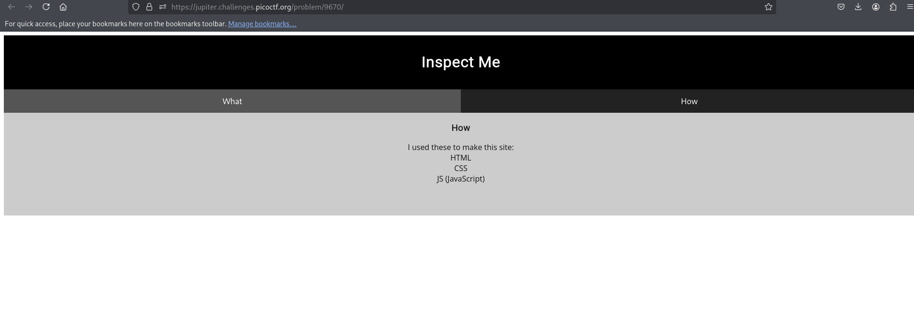

<br>

So, we can start by inspecting the page source.

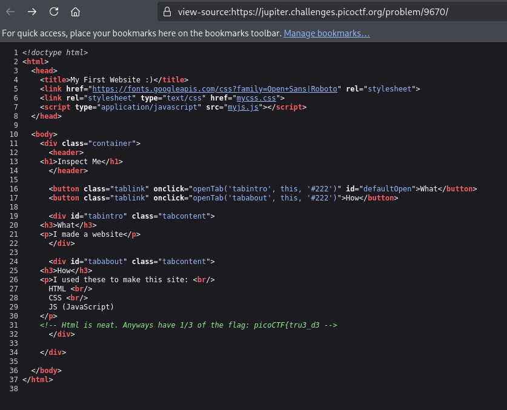

<br>

As you can see in the image, part of the flag is there. But where is the rest? The phrase says that “HTML is neat,” and the site mentions that it was made using HTML, CSS, and JavaScript.

At the beginning of the code, we can see references to CSS: `href="mycss.css"` and another to JavaScript: `src="myjs.js"`.

If we access them, we’ll find the second and third parts of the flag.


<br>

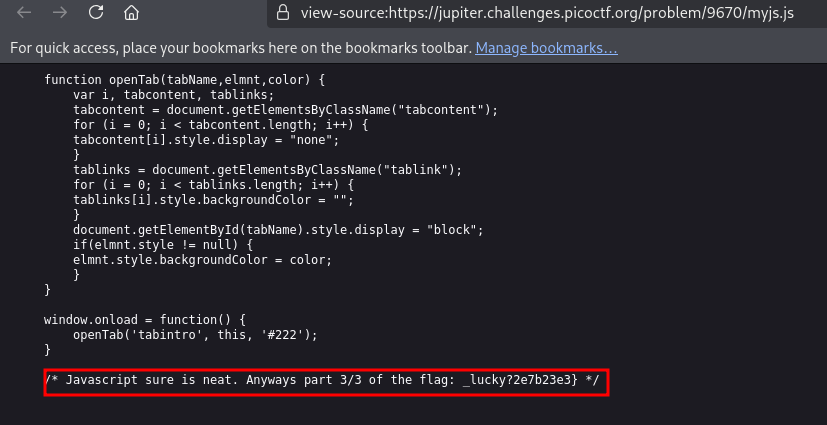

<br>

# Don't-Use-Client-Side

*“Can you break into this super secure portal? https://jupiter.challenges.picoctf.org/problem/37821/ (link) or http://jupiter.challenges.picoctf.org:37821”*

<br>

When we enter the site, there’s only a box that requires valid credentials.

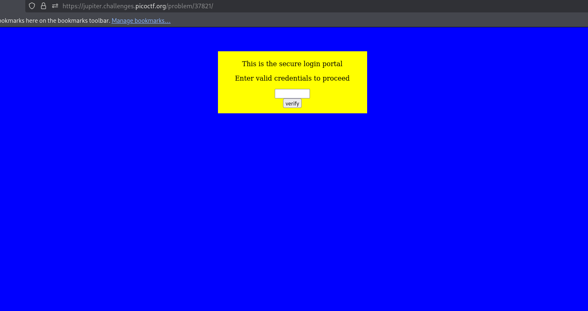

<br>

At first, I thought it would require some client-side vulnerability exploitation. But I decided to check the source code.

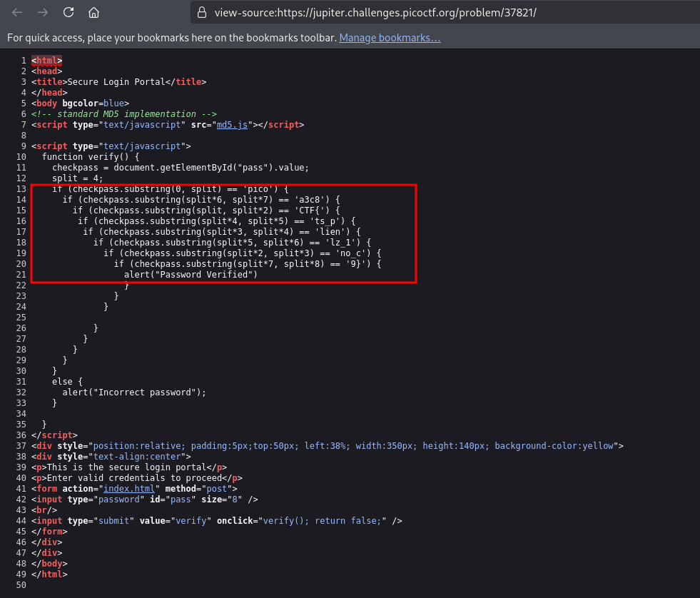

<br>

Although it seems correct, the flag isn’t in order. You can follow the variable splits: 0, split; split, split*2; split*2, split*3; etc.

Flag: picoCTF{no_clients_plz_1*a3c89}

# GET aHEAD

*“Find the flag being held on this server to get ahead of the competition http://mercury.picoctf.net:28916/”*

<br>

When we enter the site, there are only two interactive boxes that change the background color.

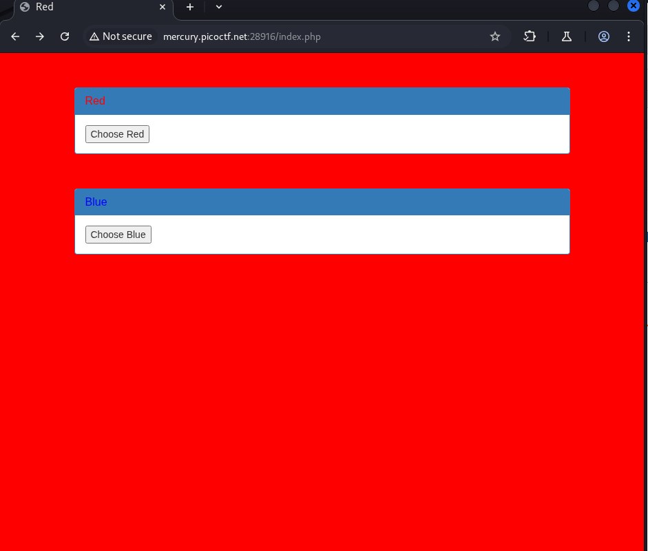

<br>

I checked the source code, but there was nothing there. So, I decided to check the requests in Burp Suite. As we can see, when we choose the red color, we receive a GET request, and the blue one sends a POST request.


<br>

The name of the challenge is GET aHEAD, which is a big hint. I sent a GET request to the Repeater function and changed the method to HEAD. When we send the HEAD request, the flag appears.

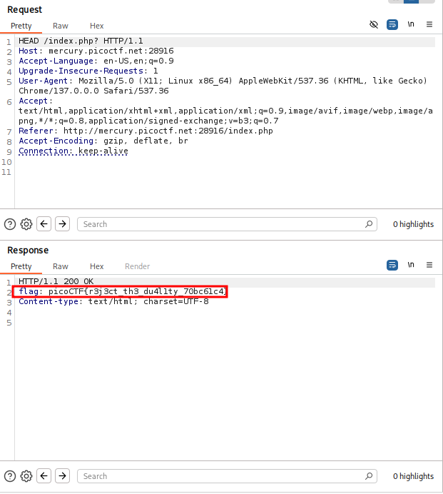

<br>

# Logon

*“The factory is hiding things from all of its users. Can you login as Joe and find what they've been looking at? https://jupiter.challenges.picoctf.org/problem/13594/ (link) or http://jupiter.challenges.picoctf.org:13594”*

<br>

When we access the site, there’s only a login box.

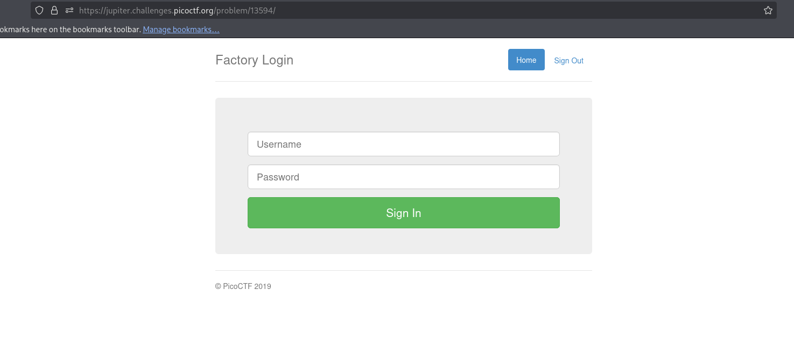

<br>

Checking the source code reveals nothing useful. Let’s send this to the proxy in Burp Suite and try to log in with basic credentials—in this case, I’ll use `admin:12345`.

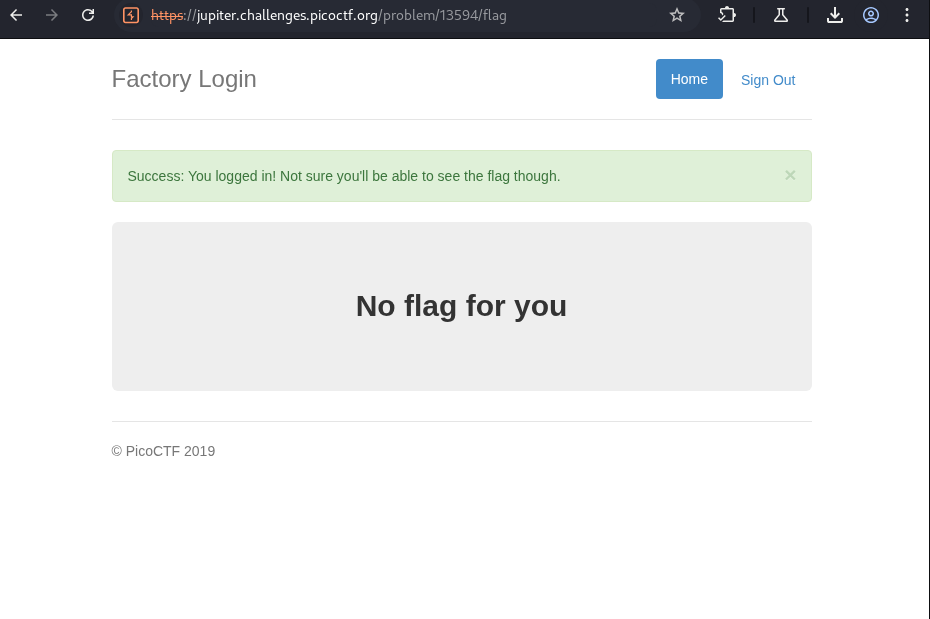

<br>

Here’s the response on the login page. The Burp Suite response is interesting:


<br>

The admin cookie parameter is set to False. Maybe we can change it?

Going back to the page, we can open Inspect Mode. In the Application tab, under Cookies, we can see the admin parameter.


<br>

Now, we change False to True and refresh the page. And there’s the flag.

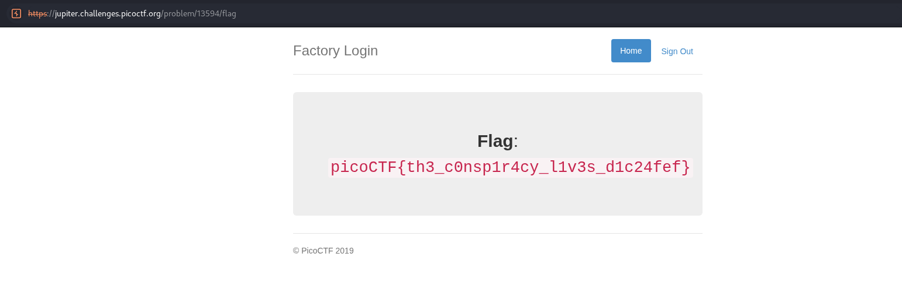

<br>

# Inspect HTML

*“Can you get the flag? Go to this website and see what you can discover.”*

<br>

Going to the page, it’s a simple page with some text.


<br>

However, the name of the challenge tells us what to do. By checking the page’s source code, we find the flag right there.

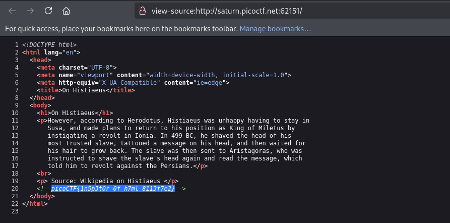

<br>

# Bookmarklet

*“Why search for the flag when I can make a bookmarklet to print it for me?”*

<br>

After launching the instance, we receive a link to the site. On the site, there’s some text and a box with code.

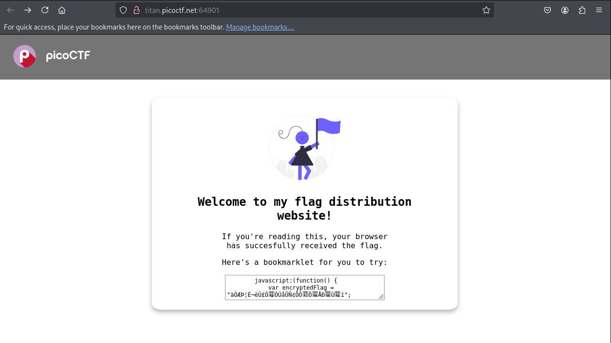

<br>

At first, I thought we’d need to run an XSS script or exploit another web vulnerability. But I decided to examine the code.

```jsx
    javascript:(function() {
        var encryptedFlag = "àÒÆަȬë٣֖ÓÚåÛÑ¢ÕӗԚÅКٖí";
        var key = "picoctf";
        var decryptedFlag = "";
        for (var i = 0; i < encryptedFlag.length; i++) {
            decryptedFlag += String.fromCharCode((encryptedFlag.charCodeAt(i) - key.charCodeAt(i % key.length) + 256) % 256);
        }
        alert(decryptedFlag);
    })();

```

This JavaScript code decrypts an encrypted flag using a simple XOR-like decryption algorithm with the predefined key `"picoctf"`. The code decrypts the `encryptedFlag` using this key. The final output will be the flag displayed in a browser alert.

In this case, we just have to run it.

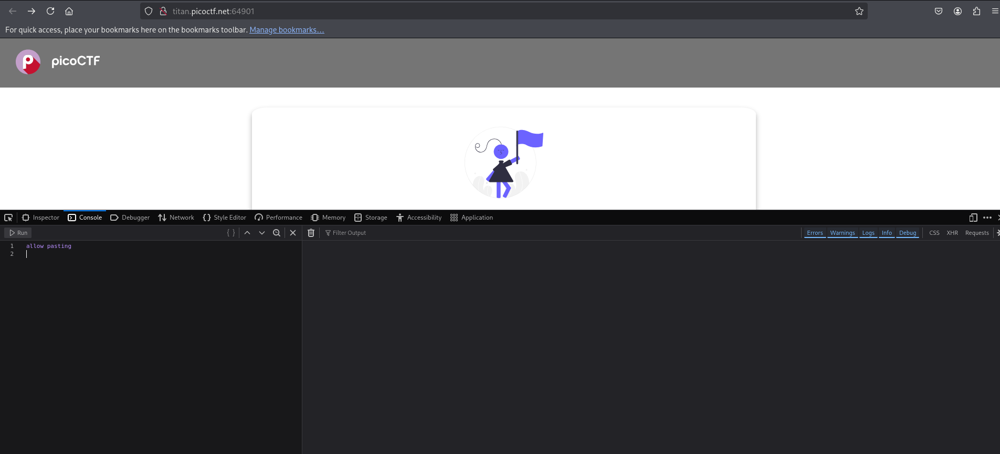

<br>

Opening the console in Inspect Mode, we first type "allow pasting" before inserting the code. Running the code opens an alert pop-up containing the flag.

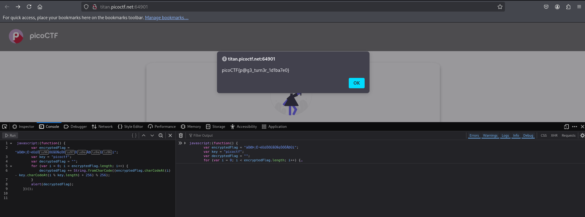

<br>

# Cookies

*“Who doesn't love cookies? Try to figure out the best one. http://mercury.picoctf.net:29649/”*

<br>

Accessing the site, we see only a text with an input box.

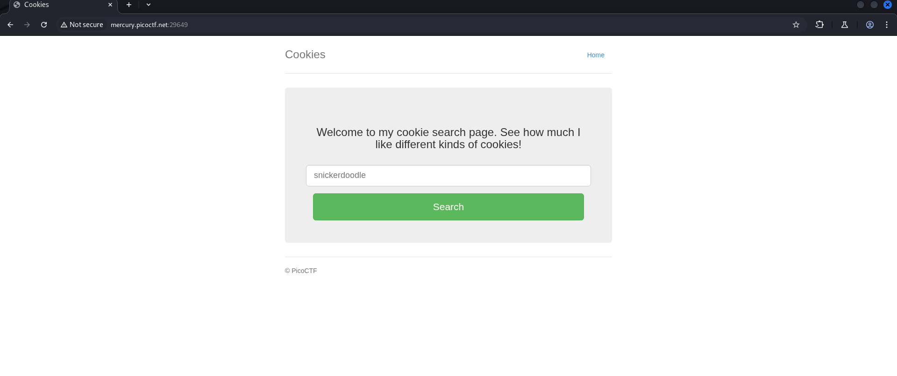

<br>

The source code doesn’t provide any clues. So, I decided to enter the suggestion shown in the input box, and we get this result:

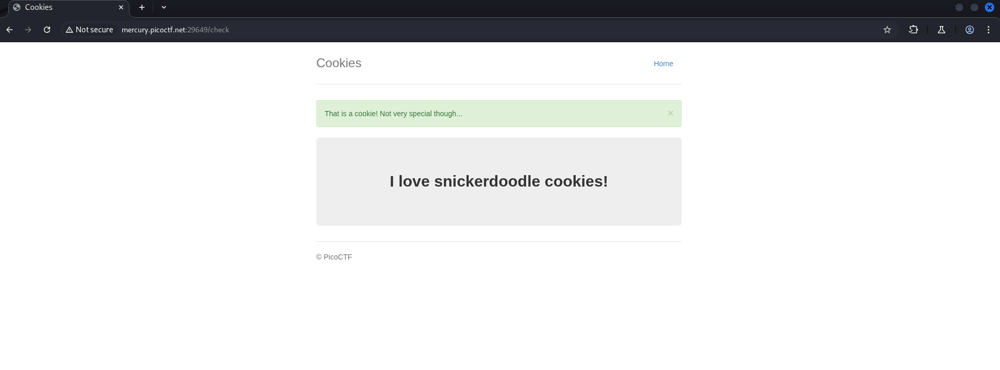

<br>

If we try typing something else in the box, we receive the message: “That doesn't appear to be a valid cookie.”

When we send the site to the proxy in Burp Suite, we see this:

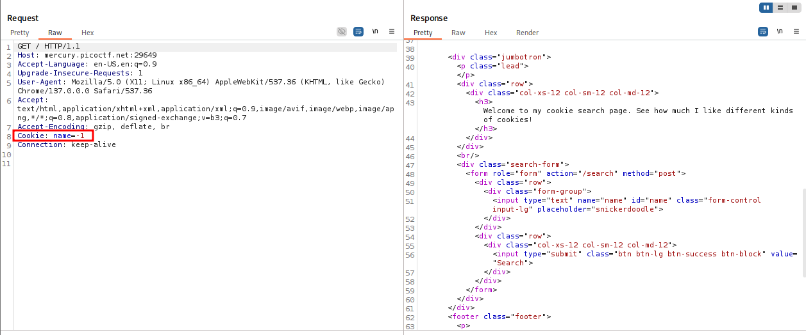

<br>

Looking at the "snickerdoodle" request, we notice that the name value changes.

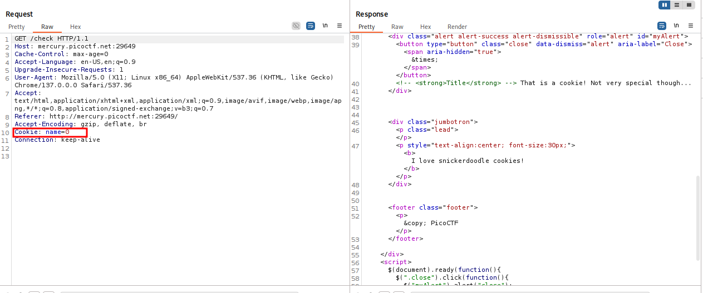

<br>

I tried entering other cookie names and random values, but nothing changed. If the flag was tied to the name value, the easiest way to check would be with a script.

```python
import requests

def find_flag():
    url = "http://mercury.picoctf.net:29649/check"
    
    for name_value in range(1, 21):  # Test from 1 to 20
        cookies = {"name": str(name_value)}
        
        try:
            response = requests.get(url, cookies=cookies)
            response.raise_for_status() 
            
            if "pico" in response.text:
                print(f"\nFlag found with name={name_value}!")
                print("Full answer:")
                print(response.text)
                
                # Extracts only the flag if it is in standard format
                if "picoCTF{" in response.text:
                    start = response.text.find("picoCTF{")
                    end = response.text.find("}", start) + 1
                    flag = response.text[start:end]
                    print(f"\nFlag extracted: {flag}")
                
                return  
            
            print(f"Testing name={name_value}... Does not contain the flag", end="\r")
        
        except requests.RequestException as e:
            print(f"\nError testing name={name_value}: {e}")
            continue

if __name__ == "__main__":
    print("searching the flag...")
    find_flag()
```

This Python script brute-forces values from 1 to 20 for the name parameter, checks each response for the string "pico", and prints the successful cookie value along with the flag when found.

When we run the script, we discover that the correct value for name is 18, and the flag is located at the end of the page's HTML source code.

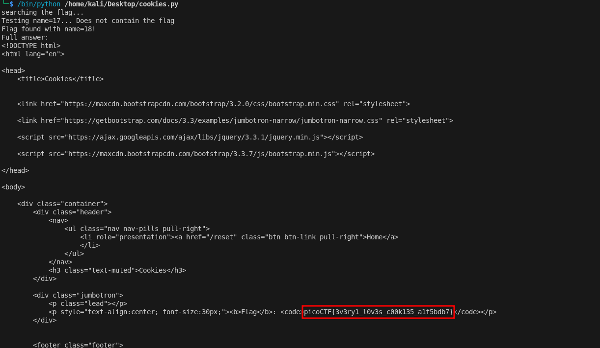

<br>
