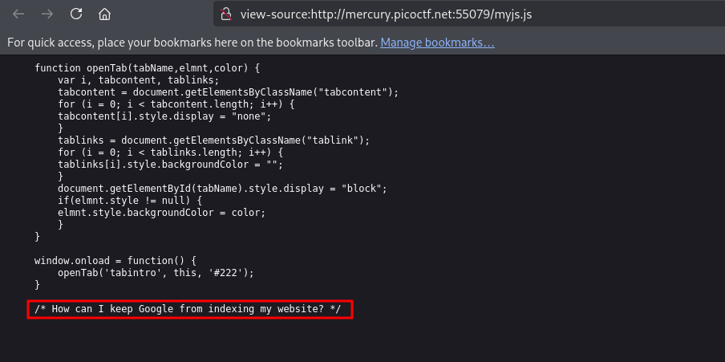

This challenge is similar to Insp3ct0r, but a little different and longer. When we access the page, we see two interactive boxes. In the “what” section, we get hints that the site is using HTML, CSS, and JavaScript.

In the source code, we can see the first part of the flag and references to CSS: `href="mycss.css"` and JavaScript:`src="myjs.js"`.

Opening `mycss.css`, we find the second part of the flag.

However, when we access `myjs.js`, instead of a flag part, we find a hint. As we know, to give indexing instructions to bots, the site uses the `robots.txt` file.

There, we find the third part of the flag and the next hint. This time, I had to search for the common configuration file used by Apache: `.htaccess` — an Apache HTTP Server configuration file.

Checking `.htaccess`, we find the fourth part of the flag along with another hint.

Searching again, I discovered that on poorly configured servers, we can sometimes find files and directories left behind by developers using macOS. One of them is `.DS_Store`, a hidden file that stores folder metadata on macOS. Accessing it on the site, we retrieve the last part of the flag.

